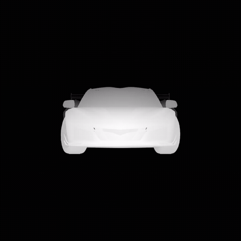
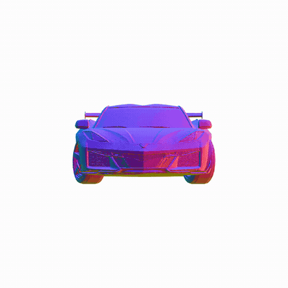
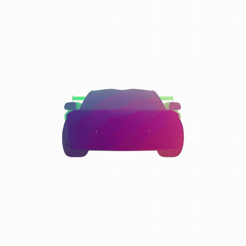

# Assets Render Passes — Blender Add-on

> **Blender tools for camera rigs, animated tours, mesh normalization, and depth / normal / position map rendering — all from a single sidebar panel.**


---

## What it does

| Tool | Description |
|---|---|
| **Camera Setup** | Creates the 8 orthographic cameras that exactly match `Hy3DRenderMultiView` viewpoints in ComfyUI |
| **Camera Spherical Tour** | Animated camera that visits every Hunyuan3D viewpoint in a smooth spherical trajectory |
| **Camera 360 Tour** | Clean 360° horizontal orbit around the asset — configurable elevation, seamlessly looping |
| **Normalize Mesh** | Centers and scales your mesh to match Hunyuan3D's preprocessing (bounding sphere = 1.15) |
| **Render Passes** | Depth, surface normal, and position maps — image sequence or MP4, Hunyuan3D-compatible output |

---

## Install

**Option A — from zip (recommended)**
```
./package_addon.sh          # generates novelviews_assets.zip
```
Then in Blender: **Edit → Preferences → Add-ons → Install…** → select the zip → enable **"3D View: Blender Render Passes"**

**Option B — directly from the repo**

Symlink or copy `blender_addon/` into your Blender add-ons folder:
```
~/.config/blender/<version>/scripts/addons/blender_render_passes/
```

Open the **N-panel** in the 3D Viewport → **Render Passes** tab.

---

## Render Passes

One click sets up the full compositor graph and renders depth, surface normals, or position maps with preprocessing that matches Hunyuan3D's expected input format.

| Pass | Details |
|---|---|
| **Depth** | Per-frame masked min-max normalization · near = white, far = black · black background |
| **Surface Normal** | Camera-space normals remapped −1..1 → 0..1 · white background |
| **Position** | World-space XYZ → RGB via `pos / scale_factor + 0.5` · white background |
| **Output** | PNG image sequence or H.264 MP4 |
| **Preview Frame** | Renders only the current frame to verify before a full render |
| **Color Management** | Automatically set to Display P3 / Raw for Hunyuan3D-compatible output |

<table>
<tr>
  <td align="center"><b>Depth</b></td>
  <td align="center"><b>Surface Normal</b></td>
  <td align="center"><b>Position</b></td>
</tr>
<tr>
  <td></td>
  <td></td>
  <td></td>
</tr>
</table>

---

## Camera Tools

### Camera Setup
Reproduces the exact viewpoints used by Hunyuan3D's multi-view renderer so renders in Blender match ComfyUI output 1:1.

- **8 orthographic cameras** (top, right, bottom, left, back, front, front-left, front-right)
- Configurable distance, ortho scale, and render resolution
- Track-To constraint option for easy post-hoc adjustment

### Camera Spherical Tour
A single camera animated along a spherical path through all 8 viewpoints — useful for previewing how a model looks from every angle.

- Configurable travel duration and pause time at each waypoint
- Parallel-transported up vector (no roll flips)
- Linear interpolation throughout

### Camera 360 Tour
Smooth 360° orbit around the world Z axis — the most natural "turntable" view.

- Configurable elevation and revolution duration
- Pure yaw rotation, no roll
- Keyframes get a **Cycles modifier** for seamless timeline looping

---

## Normalize Mesh
Matches Hunyuan3D's internal mesh preprocessing before inference.

- Centers mesh at origin
- Scales uniformly so the bounding sphere diameter equals the target value (default 1.15)

---

## Compatibility

- Blender **3.0+** (tested on 4.4)
- Works with any mesh — not limited to Hunyuan3D assets

---

## License

[MIT](LICENSE)
